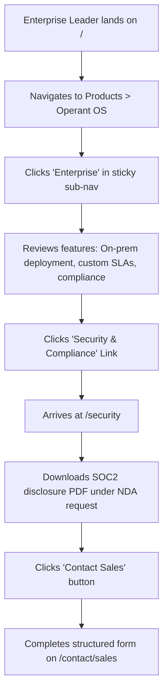
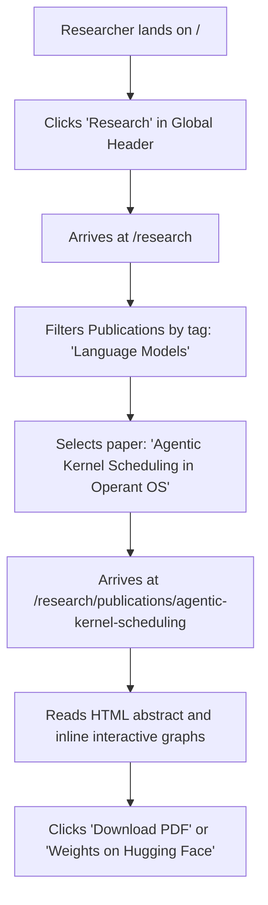
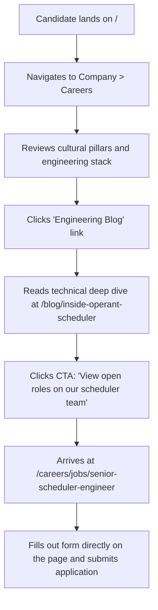

# Stone Circuit Website Information Architecture & Strategy
**Document Version:** 1.0.0  
**Author:** Principal Product Designer & Information Architect, Stone Circuit  
**Date:** July 2026  

---

## 1. Website Goals

The Stone Circuit web presence is not a simple marketing landing page. It is the digital anchor for the company’s entire ecosystem, housing commercial product lines, developer infrastructure, primary research, corporate operations, and talent recruitment. 

Over a 10-year horizon, the website must achieve the following core objectives:

*   **Establish Cognitive OS Category Leadership:** Position Stone Circuit as the definitive creator of agentic operating systems, with **Operant OS** serving as the flagship benchmark.
*   **Frictionless Developer Activation:** Minimize the time-to-value for software engineers integrating Operant OS. The site must serve as a high-speed funnel to documentation, API keys, and SDK installation.
*   **Institutional & Enterprise Trust:** Provide enterprise buyers with clear paths to compliance materials, security posture (SOC2, ISO 27001), SLAs, and structured sales contact flows.
*   **Research Distribution Platform:** Act as a first-party publisher for Stone Circuit’s scientific papers, model architectures, alignment reports, and benchmarks—similar to a modern academic repository.
*   **Top-Tier Recruitment Hub:** Position the company as the premier workplace for systems engineering, AI research, and design talent by articulating hard technical problems, team culture, and offering an elegant application experience.
*   **Future-Proof Extensibility:** Establish a modular structure that allows the seamless addition of new products, developer tooling, and company initiatives without requiring structural redesigns.

---

## 2. Target Audience

Stone Circuit serves a highly technical, diverse user base. The website architecture is structured around five primary personas:

```
┌─────────────────────────────────────────────────────────────────────────┐
│                         STONE CIRCUIT AUDIENCE                          │
└───────────────────┬─────────────────────────────────┬───────────────────┘
                    │                                 │
   ┌────────────────┴─────────────┐           ┌───────┴─────────────┐
   ▼                              ▼           ▼                     ▼
Builders                       Deciders    Pioneers              Talent & Public
┌────────────────────────┐  ┌───────────┐  ┌──────────────────┐  ┌──────────────────┐
│ Systems & AI Engineers │  │ CTOs/VPs  │  │ AI Researchers   │  │ Future Talent    │
│ • Low-friction APIs    │  │ • SOC2    │  │ • Publications   │  │ • Culture / Stack│
│ • Copy-paste SDKs      │  │ • SLAs    │  │ • Datasets       │  │ • Open roles     │
│ • Interactive docs     │  │ • Pricing │  │ • Benchmarks     │  │ • Core problems  │
└────────────────────────┘  └───────────┘  └──────────────────┘  └──────────────────┘
```

1.  **Systems & AI Engineers (The Builders):**
    *   *Needs:* High-speed search, copy-pasteable SDK snippets, interactive API references, system status indicators, and low-latency dark-mode documentation.
    *   *Tone:* Direct, technical, transparent, and utility-first.
2.  **Enterprise CTOs & Engineering leaders (The Deciders):**
    *   *Needs:* Clear value propositions, compliance docs (SOC2 Type II, HIPAA, GDPR), support tiers, migration guides, and case studies proving scale.
    *   *Tone:* Secure, reliable, authoritative, and business-enabling.
3.  **AI Researchers & Academics (The Pioneers):**
    *   *Needs:* Downloadable PDF publications, clean academic citations, benchmark results, dataset downloads, and safety alignment documentation.
    *   *Tone:* Scientific, precise, objective, and open-source leaning.
4.  **Future Candidates (The Talent):**
    *   *Needs:* Culture statements, engineering blog posts, team profiles, deep dives into technical challenges, clear benefits, and a frictionless jobs board.
    *   *Tone:* High-agency, intellectually curious, mission-driven, and welcoming.
5.  **Industry Observers, Journalists, & Investors (The Public):**
    *   *Needs:* Press kits, company mission, leadership bios, contact channels, and chronological company announcements.
    *   *Tone:* Polished, narrative-driven, and forward-looking.

---

## 3. Navigation Structure

To accommodate a vast content footprint without overwhelming the user, the website utilizes a multi-dimensional navigation system.

### Global Header
Persistent across the entire site (except inside fullscreen interactive playgrounds or console interfaces). It uses a subtle glassmorphic backdrop (`backdrop-filter: blur(12px)`) to integrate with dynamic content.

*   **Brand Mark:** Minimalist Stone Circuit glyph + wordmark. Clicking routes to `/`.
*   **Mega-Menu Dropdowns:**
    *   **Products:** Operant OS (Flagship), future product slots (Stone Database, Compute Engine), and a link to the general Products Index.
    *   **Developers:** Docs, API Reference, SDKs, Changelog, System Status, and Community.
    *   **Research:** Publications, Alignment, Datasets, and Benchmarks.
    *   **Company:** About, Careers, Blog, Press.
*   **Global Search Trigger:** A prominent visual button displaying `Search...` and the keyboard shortcut shortcut pill `⌘K` (or `Ctrl+K` on Windows/Linux).
*   **Call to Action (CTA) Pair:**
    *   *Secondary:* `Sign In` (routes to `console.stonecircuit.com`)
    *   *Primary:* `Get Started` (routes to `/docs/operant-os/getting-started` or the Console signup)

### Contextual Sidebar Navigation
Appears on `/docs`, `/api-reference`, and `/research` sub-sections.
*   **Sticky Left Column:** Scroll-locked independently of the main content pane.
*   **Hierarchical Tree:** Multi-level collapsible sections. Active states are highlighted with left-border indicators and high-contrast typography.
*   **Context Control:** Includes a product-version selector (dropdown) at the top of the sidebar when navigating documentation.

### Command Menu (CMD+K / Ctrl+K)
An overlay interface that gives power-users immediate, keyboard-driven navigation across the site.
*   **Search Input:** Focused instantly upon activation.
*   **Segmented Results:** Grouped by *Documentation*, *API Reference*, *Research*, *Blog*, and *Actions* (e.g., "Toggle Theme", "View System Status").
*   **Keyboard Shortcuts:** Up/Down arrows to select, Enter to route, Escape to close.

### Breadcrumb Navigation
Present on all deeply nested pages (depth > 2) to maintain spatial awareness.
*   *Format:* `Home / Products / Operant OS / Pricing`
*   *Behavior:* Hovering over any breadcrumb step reveals a dropdown of sibling pages for rapid sideways navigation.

---

## 4. Complete Sitemap

The following sitemap details the page relationships across the entire Stone Circuit domain:

```
stonecircuit.com (Root)
├── / (Home/Hub Page)
├── /products (Products Index)
│   └── /products/operant-os (Operant OS Flagship Hub)
│       ├── /products/operant-os/features (Detailed Feature Breakdown)
│       ├── /products/operant-os/pricing (Tiered Pricing Structure)
│       └── /products/operant-os/enterprise (Enterprise Solutions)
├── /research (Research Hub)
│   ├── /research/publications (Scientific Papers Index)
│   │   └── /research/publications/[paper-slug] (Individual Paper / Reader View)
│   ├── /research/safety (Alignment, Ethics & Safety Frameworks)
│   └── /research/benchmarks (Performance & Capabilities Testing)
├── /docs (Documentation Portal)
│   ├── /docs/operant-os (Operant OS Documentation Root)
│   │   ├── /docs/operant-os/getting-started (Installation, Basic Concepts)
│   │   │   └── /docs/operant-os/getting-started/[slug] (Nested guides)
│   │   ├── /docs/operant-os/kernel-architecture (Deep-dive hardware/software interfaces)
│   │   ├── /docs/operant-os/agent-scheduler (Multi-agent orchestration mechanics)
│   │   └── /docs/operant-os/guides (Tutorials and Reference implementations)
│   └── /docs/future-product (Ready-made slot for new products)
├── /api-reference (Unified API Reference Hub)
│   ├── /api-reference/operant-os (Operant OS OpenAPI Specs)
│   │   ├── /api-reference/operant-os/endpoints (REST / WebSocket endpoints)
│   │   └── /api-reference/operant-os/sdks (Official SDK interfaces)
│   └── /api-reference/future-product (Ready-made slot)
├── /changelog (Product Updates Index)
│   └── /changelog/[slug] (Release-specific detail page)
├── /blog (Engineering, Design & Corporate Blog)
│   └── /blog/[slug] (Individual Post View)
├── /careers (Careers Portal)
│   ├── /careers/jobs (Job Board Listing)
│   │   └── /careers/jobs/[id] (Job Description & Application)
│   └── /careers/teams (Structure: Kernel, Infrastructure, Research, Design)
├── /about (Mission, Timeline, Leadership & Board)
├── /contact (Universal Contact Router)
│   ├── /contact/sales (High-value enterprise intake)
│   ├── /contact/support (Developer ticketing router)
│   └── /contact/press (Media relations and assets)
├── /security (Trust Center, SOC2/ISO certificates, Vulnerability disclosures)
└── /legal (Index of Policies)
    ├── /legal/terms (Terms of Service)
    ├── /legal/privacy (Privacy Policy)
    └── /legal/dpa (Data Processing Agreement)
```

---

## 5. Route Structure

A clean, human-readable route structure is vital for SEO, shareability, and user navigation.

| Primary Category | Route Path | Dynamic Parameters | Notes |
| :--- | :--- | :--- | :--- |
| **Home** | `/` | None | Brand introduction, primary product access, latest news. |
| **Products** | `/products` | None | Grid of all products (currently Operant OS, designed for scale). |
| **Product Detail**| `/products/[product-slug]` | `product-slug` (e.g. `operant-os`) | Marketing/technical hub for a single product. |
| **Product Sub** | `/products/[product]/[sub-page]` | `product` (e.g. `operant-os`), `sub-page` (e.g. `pricing`) | Sub-pages of products. |
| **Research Hub** | `/research` | None | Landing page for research, latest papers, alignment statements. |
| **Publications** | `/research/publications` | None | List of all papers. Supports tagging (NLP, Kernels, Agents). |
| **Paper View** | `/research/publications/[paper]` | `paper` (e.g. `agentic-kernel-scheduling`) | Paper abstract, HTML reader, raw PDF and dataset access. |
| **Documentation** | `/docs` | None | General landing page. Automatically redirects to primary product docs. |
| **Doc Section** | `/docs/[product]/[section]/[slug]` | `product` (e.g. `operant-os`), `section` (e.g. `getting-started`), `slug` | Nested documentation markdown content files. |
| **API Reference** | `/api-reference/[product]` | `product` (e.g. `operant-os`) | Interactive API explorer (three-column layout). |
| **Changelog** | `/changelog` | None | Timeline of updates. Filterable by product tags. |
| **Blog** | `/blog` | None | Company announcements, engineering deep-dives, designs. |
| **Blog Post** | `/blog/[post-slug]` | `post-slug` (e.g. `designing-operant-os-kernel`) | Full article layout optimized for code blocks and media. |
| **Careers** | `/careers` | None | Culture, benefits, employee spotlights. |
| **Job Listings** | `/careers/jobs` | None | Live feed of open roles. Filterable by location and team. |
| **Job App** | `/careers/jobs/[job-id]` | `job-id` (numeric or alpha string) | Job details page + integrated application form. |
| **Security** | `/security` | None | Compliance, security policies, reporting guidelines. |
| **Legal** | `/legal/[policy]` | `policy` (e.g. `privacy`, `terms`, `dpa`) | Legal compliance documents. |

---

## 6. Page Hierarchy

To maintain a logical information hierarchy, the website structure is divided into three tiers:

```
┌─────────────────────────────────────────────────────────────────────────────┐
│                            TIER 1: THE BRAND HUB                            │
│                  - Home page, main routes, mega-navigation                  │
│                                                                             │
│        ┌─────────────────────────────────────────────────────────────┐      │
│        │                   TIER 2: PORTAL HUBS                       │      │
│        │           - Products, Docs, Research, Careers               │      │
│        │                                                             │      │
│        │        ┌─────────────────────────────────────────────┐      │      │
│        │        │           TIER 3: UTILITY CONTENT           │      │      │
│        │        │      - Markdown Docs, API Spec, Jobs        │      │      │
│        │        └─────────────────────────────────────────────┘      │      │
│        └─────────────────────────────────────────────────────────────┘      │
└─────────────────────────────────────────────────────────────────────────────┘
```

### Tier 1: The Brand Hub (Global Visibility)
*   **Access:** Persistent Global Header/Footer.
*   **Behavior:** Highly polished, heavy usage of bespoke motion designs, storytelling visual components, and editorial styling.
*   **Pages:** Home (`/`), Products Overview (`/products`), Research Landing (`/research`), Careers Overview (`/careers`), Company Blog (`/blog`).

### Tier 2: Portal Hubs (Thematic Gateways)
*   **Access:** Reached via Tier 1 global navigation. Introduces local layouts (e.g., sidebars).
*   **Behavior:** Optimized for categorization. Balanced between visual communication and text readability.
*   **Pages:** Operant OS Hub (`/products/operant-os`), Docs Portal (`/docs`), Careers Job Board (`/careers/jobs`), Publications List (`/research/publications`).

### Tier 3: Utility Content (High-Density Readability)
*   **Access:** Sidebar navigation, breadcrumbs, search, deep-linking.
*   **Behavior:** Minimalist branding. Maximum layout width constraints to prevent long lines of text (`max-w-screen-md` or `65ch` for reading). High-density information display.
*   **Pages:** Individual Markdown Guides (`/docs/operant-os/getting-started/installation`), API Endpoint Details (`/api-reference/operant-os/endpoints`), Job Application form (`/careers/jobs/[id]`), Scientific paper (`/research/publications/[paper]`).

---

## 7. User Journeys

The information architecture must guarantee that key user flows require the fewest steps possible. Below are four core journeys mapped step-by-step:

### Flow A: Developer onboarding to Operant OS
Goal: Locate the quickstart guide, install the SDK, and obtain API credentials.
```mermaid
graph TD
    A[Visitor lands on /] --> B{Clicks 'Get Started'}
    B -->|Option 1: Desktop Header| C[/docs/operant-os/getting-started/quickstart]
    B -->|Option 2: Terminal Command on Home| D[Copy installation command npm/pip]
    C --> E[Reads Quickstart Guide]
    E --> F[Clicks link to Developer Console]
    F --> G[console.stonecircuit.com]
    G --> H[Sign up / Generate API Key]
    D --> G
```

### Flow B: Enterprise Buyer verifying security posture
Goal: Evaluate SOC2 compliance status, SLAs, and contact sales for an enterprise deployment of Operant OS.


### Flow C: AI Researcher seeking model details
Goal: Locate scientific paper details, view evaluation metrics, download PDF, and find model weights.


### Flow D: Systems Engineer applying for a job
Goal: Understand engineering culture, read an engineering blog post on the kernel, view open roles, and apply.


---

## 8. Future Expansion Plan

To prevent the website architecture from buckling under company growth over the next 10 years, the URL structure and navigation system are built to scale horizontally.

```
                  ┌─────────────────────────────────┐
                  │      stonecircuit.com/          │
                  └────────────────┬────────────────┘
                                   │
         ┌─────────────────────────┼─────────────────────────┐
         ▼                         ▼                         ▼
  /products/                /docs/                    /api-reference/
  ┌──────────────┐          ┌──────────────┐          ┌──────────────┐
  │ /operant-os  │          │ /operant-os  │          │ /operant-os  │
  ├──────────────┤          ├──────────────┤          ├──────────────┤
  │ /stone-db    │ [NEW]    │ /stone-db    │ [NEW]    │ /stone-db    │ [NEW]
  ├──────────────┤          ├──────────────┤          ├──────────────┤
  │ /compute     │ [NEW]    │ /compute     │ [NEW]    │ /compute     │ [NEW]
  └──────────────┘          └──────────────┘          └──────────────┘
```

### 1. Scaling the Product Line (Horizontal Expansion)
*   **Current State:** One product (`Operant OS`).
*   **Growth Scenario:** Stone Circuit releases *Stone Database* and *Circuit Compute*.
*   **Architectural Action:**
    *   The `/products` page changes from an Operant OS splash to a categorized grid.
    *   Separate directories `/products/stone-db` and `/products/compute` are created.
    *   Documentation maps directly to `/docs/stone-db` and `/docs/compute`.
    *   The Global Header "Products" menu updates to list these three lines with simple sub-icons.

### 2. Scaling Research Activities
*   **Growth Scenario:** Stone Circuit launches dedicated research groups (e.g., Alignment Lab, Systems Research Group, Human-AI Interface Lab).
*   **Architectural Action:**
    *   Introduce lab-specific routes: `/research/labs/[lab-name]`.
    *   Add filters on `/research/publications` to sort by specific labs, along with search capability for research papers.

### 3. Scaling Developer Ecosystem
*   **Growth Scenario:** Addition of third-party developer integrations, plugins, and app marketplaces.
*   **Architectural Action:**
    *   Reserve the routes `/developers` (general hub), `/docs/[product]/plugins`, and `/integrations` for future partner ecosystems.

---

## 9. Product Navigation Strategy

When navigating a complex software site, users must never lose track of whether they are reading about the general company, a specific product, or documentation.

### Product-Specific Sub-Navigation (Subheader)
When a user enters a product section (e.g., `/products/operant-os/*`), a secondary sticky navigation bar appears directly beneath the main global header:

```
┌─────────────────────────────────────────────────────────────────────────────┐
│  STONE CIRCUIT [Logo]      Products   Research   Developers   Company       │ (Global Header)
├─────────────────────────────────────────────────────────────────────────────┤
│  Operant OS                Overview   Features   Pricing      Enterprise    │ (Product Subheader)
└─────────────────────────────────────────────────────────────────────────────┘
```

*   **Behavior:** 
    *   Slides down subtly on scroll transition into a product page; stays locked at the top of the viewport.
    *   The product title is displayed on the left (e.g., "Operant OS"), functioning as a quick anchor back to `/products/operant-os`.
    *   Right-aligned navigation links: `Overview`, `Features`, `Pricing`, `Enterprise`.
    *   Includes a prominent contextual CTA button (e.g., "Deploy Now") that changes based on the product.

### Mega-Menu Product Matrix
In the Global Header, hovering over "Products" displays a layout organized by category:

1.  **Core Systems:** 
    *   *Operant OS:* Agentic Operating System for orchestrating models (Active).
    *   *Future Infrastructure Slots:* Database engine, Compute virtualization.
2.  **Developer Tooling:**
    *   *Command Line Interface:* Control local/remote kernels.
    *   *Playgrounds:* Run multi-agent simulations in-browser.
3.  **Enterprise Hubs:**
    *   *Self-Hosted / VPC:* Isolated instances.
    *   *Managed Cloud:* Scale automatically.

---

## 10. Documentation Strategy

Technical documentation is often the primary touchpoint for developers. The IA prioritizes clarity, search speed, and readable hierarchies.

### The Unified Three-Column Documentation Layout
Used for all product guides and API references:

```
┌─────────────────┬─────────────────────────────────┬─────────────────┐
│                 │                                 │                 │
│  Product/Ver    │                                 │  Page Outline   │
│  Selector       │         Main Markdown           │                 │
│  ──────────     │         Content Area            │  Quickstart     │
│                 │                                 │  Installation   │
│  Sidebar Tree   │  - Readable typography          │  Configuration  │
│  - Categories   │  - Copyable code blocks         │  Next Steps     │
│  - Guides       │  - Inline alerts/callouts       │                 │
│  - API Endpts   │                                 │  Feedback Widget│
│                 │                                 │                 │
└─────────────────┴─────────────────────────────────┴─────────────────┘
```

*   **Column 1: Sidebar (20% width):** Product version selector, category trees, search input.
*   **Column 2: Content (60% width):** Large, clean typography with high readability. Content elements include:
    *   *Code Blocks:* Tabbed selectors for languages (Python, TypeScript, Rust, cURL) with code syntax highlighting and quick-copy buttons.
    *   *Interactive Playgrounds:* Embeddable code execution modules.
*   **Column 3: Utility (20% width):** Table of contents for the active page (scroll-tracked), links to "Edit this page on GitHub", and a simple thumbs-up/down helpfulness widget.

### Documentation Versioning Plan
*   **URL Structure:** `/docs/[product]/[version]/[slug]` (e.g., `/docs/operant-os/v2.1/kernel-scheduling`).
*   **Default Behavior:** If the version parameter is omitted (e.g., `/docs/operant-os/kernel-scheduling`), the server resolves to the latest stable release (`/docs/operant-os/v3.0/...`) via server-side redirect or rewrite.
*   **Outdated Notice:** Pages under an older version display a prominent warning banner at the top: *"You are viewing documentation for an older version (v1.2). [Switch to latest version (v2.0)]."*

---

## 11. Mobile Navigation Strategy

Technical resources require careful layout design on mobile viewports. The mobile strategy simplifies interactions and focuses on utility.

### Mobile Header Layout
*   **Visible Elements:** Brand mark (left), Global Search Icon (middle-right), and a Hamburger Menu button (right).
*   **Tap Targets:** Minimum size of `44px x 44px` with clear padding.

### Responsive Navigation Drawer
Clicking the hamburger menu triggers a full-screen overlay drawer:
*   **Accordion Folders:** Top-level categories (Products, Research, Developers, Company) expand downward when tapped, rather than loading a new page, preventing page-load latency.
*   **Quick Console Link:** A prominent button at the bottom of the drawer: "Console / Sign In".

### Mobile Documentation Navigation (The Bottom Bar / Drawer)
To avoid wasting vertical screen space on mobile documentation pages:
*   **Hide the Sidebar:** The left-hand sidebar is hidden on screens under `768px` wide.
*   **Floating Navigation Button:** A floating action button (FAB) labeled `Table of Contents` or `Docs Menu` appears at the bottom-center of the viewport.
*   **Overlay Drawer:** Tapping the FAB slides up a sheet containing the documentation category tree. This allows users to jump sections without scrolling back to the top of the page.

---

## 12. Footer Structure

The footer provides navigation for users who reach the end of a page, serving as a directory map for the entire site.

```
┌─────────────────────────────────────────────────────────────────────────────┐
│  STONE CIRCUIT                                                              │
│                                                                             │
│  Products      Developers      Research        Company        Legal         │
│  Operant OS    Docs            Publications    About          Terms         │
│  Stone DB      API Reference   Safety          Careers        Privacy       │
│  Compute       Changelog       Datasets        Blog           DPA           │
│  Console       Status          Benchmarks      Press          Security      │
│                                                                             │
│  ─────────────────────────────────────────────────────────────────────────  │
│  © 2026 Stone Circuit Inc.   [Status: All Systems Operational]  [Dark/Light] │
└─────────────────────────────────────────────────────────────────────────────┘
```

### Column Layout (5 Columns)
1.  **Products:** Operant OS, Stone DB (Placeholder), Compute (Placeholder), Developer Console, Pricing.
2.  **Developers:** Documentation, API Reference, SDKs & Libraries, GitHub Organization, System Status.
3.  **Research:** Publications, Alignment, Datasets, Open Source Models, Safety Audits.
4.  **Company:** About Us, Careers (with a "We're Hiring" badge), Brand Assets, Press Kit, Contact.
5.  **Legal & Trust:** Terms of Service, Privacy Policy, DPA, Security Center, Trust Report.

### Bottom Row Elements
*   **Copyright Text:** `© 2026 Stone Circuit Inc.`
*   **System Status Indicator:** A live status widget consisting of a colored indicator dot (Green = operational, Yellow = degraded, Red = outage) and a link to `/status`.
*   **Global Theme Switcher:** A button interface allowing users to select `Dark`, `Light`, or `System` themes.
*   **Social & Community Links:** Icon links to GitHub, X (Twitter), LinkedIn, and Discord.

---

## 13. Search Strategy

A fast, smart search tool is essential for technical websites. It is the primary navigation method for developers and power users.

### 1. The CMD+K Interface
*   **Instantiation:** Instantly rendered when clicking the header search bar or pressing `⌘K` / `Ctrl+K`.
*   **Performance Target:** Average response time under **50ms** for search-as-you-type results.
*   **Zero-State View:** Before the user types, the modal displays *Recent Searches*, *Starred Pages*, and *Quick Actions* (e.g., `/docs`, `/status`).

### 2. Search Result Categorization
Search results are divided by source type to help users find the right context:
*   **Documentation (`/docs`):** Matches guides and setup steps. Shows breadcrumbs (`Docs > Operant OS > Quickstart`).
*   **API Reference (`/api-reference`):** Matches methods, classes, and parameters. Syntactically formatted (e.g., `POST /v1/agent/spawn`).
*   **Research (`/research`):** Matches academic papers, abstracts, and authors.
*   **Help & Settings:** Matches website actions (e.g., "Change theme to Light Mode", "Contact support").

### 3. AI-Powered Semantic Search (Stone-Search)
*   **Keyword Match:** Traditional indexing for exact term matches (e.g., looking up a specific error code or variable name).
*   **Semantic Understanding:** Natural language processing for conceptual queries (e.g., searching for "how do I control multi-agent priority?" will point to the Scheduler guides even if the user didn't use the word "priority").
*   **AI Synthesis:** Provides a brief, AI-generated summary answering the question directly in the search UI, with links to source documentation.

---

## 14. URL Naming Conventions

URL routing follows strict rules to ensure consistency, SEO strength, and ease of use.

### 1. Case and Characters
*   **Strictly Lowercase:** All URLs must use lowercase letters.
*   **Hyphen Separators:** Use hyphens (`-`) to separate words. Do not use underscores (`_`) or spaces (`%20`).
*   *Correct:* `/docs/operant-os/getting-started`
*   *Incorrect:* `/docs/OperantOS/getting_started`

### 2. Trailing Slash Strategy
*   **No Trailing Slash:** All URLs should resolve without a trailing slash.
*   *Correct:* `/products/operant-os`
*   *Incorrect:* `/products/operant-os/`
*   **Resolution:** Implement server-side redirects to strip trailing slashes, ensuring consistent analytics tracking and SEO.

### 3. URL Cleanliness & Depth
*   **Avoid Redundancy:** Do not repeat folder names in the URL path.
*   *Correct:* `/docs/operant-os/installation`
*   *Incorrect:* `/docs/operant-os/operant-os-installation`
*   **Depth Limit:** Keep URL paths to a maximum depth of **5 levels** to maintain readability.

### 4. File-Extension Hiding
*   **Clean URLs:** Hide file extensions (like `.html`, `.md`, or `.json`) from user paths.
*   *Correct:* `/about`
*   *Incorrect:* `/about.html`

---

## 15. Design Principles

The visual design system reflects Stone Circuit’s focus on high-performance systems engineering and AI.

### 1. Typography First
*   **Body Typeface:** A highly legible sans-serif font family, such as *Geist Sans*, *Inter*, or *Segoe UI*.
*   **Monospace Typeface:** For code blocks and technical readouts, using *Geist Mono*, *Fira Code*, or *SF Mono*.
*   **Scale and Contrast:** Bold headings (`font-weight: 600` or higher) paired with spacious line-heights (`leading-relaxed` or `1.6`) for body copy to prevent reading fatigue.

### 2. High-Performance Color Palettes (Sleek Dark Mode Default)
*   **Default State:** Deep charcoal and pitch-black backgrounds, using near-white slate gray for readable body text.
*   *Neutral Range:* Avoid pure black (`#000000`) for text panels to prevent OLED smearing; use near-black grays instead (e.g., `#09090b`, `#0c0c0e`).
*   **Accent Palette:** Vibrant primary colors like neon blue, cyan, emerald green, or solar orange, used sparingly for CTAs, active states, and success indicators.
*   **Light Mode Fallback:** A clean light grey and white theme with dark grey text, designed to meet the same contrast requirements.

### 3. Depth and Layout Hierarchy (Glassmorphism & Shadows)
*   **Layering:** Floating navigation, command menus, and cards use semi-transparent backdrops (`rgba(255, 255, 255, 0.03)`) with a blur filter and a thin border (`1px solid rgba(255, 255, 255, 0.08)`) to look elevated above the page.
*   **Elevation Shadows:** Smooth, multi-layered shadows to give components a natural sense of depth.

### 4. Interactive Micro-Animations
*   **Transitions:** Hover states for buttons, navigation links, and cards should use subtle transitions (`transition: all 0.2s cubic-bezier(0.16, 1, 0.3, 1)`) rather than instant state changes.
*   **Loading States:** Custom loading skeletons that mimic the page layout, preventing layout shifts during content loads.

---

## 16. Accessibility Principles

Stone Circuit is committed to making its systems and documentation accessible to everyone, ensuring the site complies with **WCAG 2.2 AA** guidelines.

### 1. Keyboard Navigability
*   **No Keyboard Traps:** Users must be able to navigate into, out of, and through all interactive elements (like modals and dropdowns) using only the keyboard.
*   **Focus Ring Design:** All interactive elements must show a high-contrast focus indicator (e.g., a thick blue or orange border) when highlighted via keyboard focus.
*   **Skip-Links:** Implement a hidden "Skip to main content" link that appears at the top of the page when a user presses the tab key, allowing them to bypass header navigation.

### 2. Screen Reader Support & Semantic HTML
*   **Semantic Elements:** Use appropriate HTML tags (like `<header>`, `<nav>`, `<main>`, `<article>`, `<aside>`, and `<footer>`) to help screen readers navigate the page structure.
*   **ARIA attributes:** Use `aria-expanded` on dropdown triggers, `aria-controls` on menus, and `aria-live="polite"` on dynamic content updates (like toast messages or search results).
*   **Descriptive Image Alt Text:** All images must have alt descriptions explaining their contents. Decorative-only assets should use `alt=""` or `aria-hidden="true"`.

### 3. Color Contrast and Size Targets
*   **Contrast Ratio:** Standard text must have a minimum contrast ratio of **4.5:1** against its background. Large text (over 18pt bold or 24pt regular) must maintain at least a **3:1** ratio.
*   **Resizable Font Scaling:** The layout must remain functional and readable when browser fonts are scaled up to **200%**.
*   **Touch Targets:** Interactive targets on mobile must be at least **44 x 44 CSS pixels** to prevent accidental clicks.
